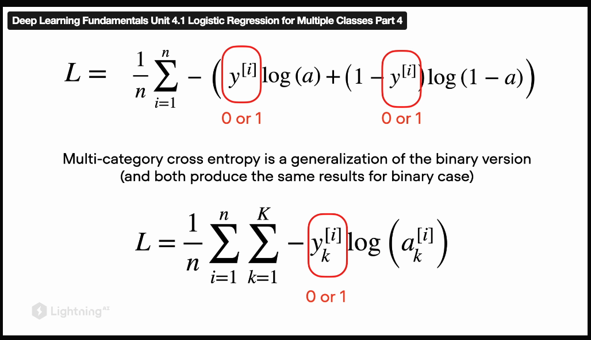

05/08/2024
1. 

class MyDataset(Dataset):

    def __init__(self, X, y):
        super().__init__() - THERE IS NO CONSTRUCTOR IN DATASET
        self.features = torch.tensor(X, dtype=torch.float32)
        self.labels = torch.tensor(y, dtype=torch.float32)

2. plt.legend(loc="upper left") instead of plt.legend(loc=2)

3. you can avoid model.train() because there are no layers that perform diffently at training and evaluation stages (like dropout and BatchNorm)

4. you do not need model = model.eval()

5. plot_boundary

26/08/24

1. Best coding practice - do not specify variable you don't use

all_x = []
for x, _ in train_loader:
    all_x.append(x)
    
train_std = torch.concat(all_x).std(dim=0)
train_mean = torch.concat(all_x).mean(dim=0)

2. explain why the formula has this concrete form

$H(p, q) = -\sum_i p_i \log q_i = -y \log \hat{y} - (1 - y) \log(1 - \hat{y}).$

https://en.wikipedia.org/wiki/Cross-entropy

https://en.wikipedia.org/wiki/Entropy_(information_theory)