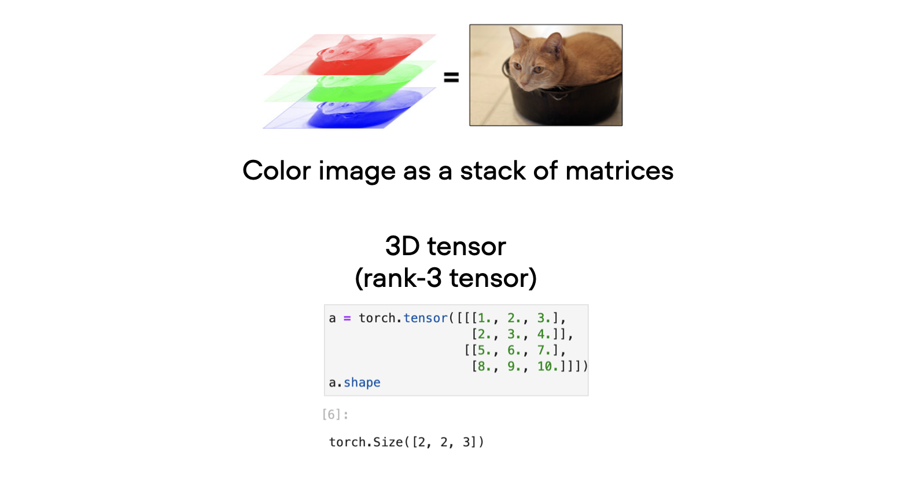

# Deep Learning Fundamentals Unit 2

## Introduction to Working with Tensors in PyTorch

What are tensors? We’re glad you asked. In Unit 2, you will learn more about tensors and familiarize ourselves with PyTorch, the most widely used deep learning library.

This Studio provides a reproducible environment with the supplementary code for Unit 2 of the [**Deep Learning Fundamentals**](https://lightning.ai/pages/courses/deep-learning-fundamentals/) class by Sebastian Raschka, which is freely available at Lightning AI.

 

**What's included?**

Click the "Run Template" button at the top of this page to launch into a Studio environment that contains the following materials:

- `code-units/`

  - `2.2-tensors/`: The code materials used in *Unit 2.2: What Are Tensors (Part 1 and 2)*

  - `2.3-using-tensors/`: The code materials used in *Unit 2.3 How Do We Use Tensors in PyTorch?*

  - `2.4-linalg/`: The code materials used in *Unit 2.4 Improving Code Efficiency with Linear Algebra (Parts 1-4)*

  - `2.5-debugging/`: The code materials used in *Unit 2.5 Debugging Code*

  - `2.6-revisiting-perceptron/`: The code materials used in *Unit 2.6 Revisiting the Perceptron Algorithm*

- `exercises/`: 
  - `1_torch-where`: Exercise 2,  learning how to use the `torch.where` function
  - `2_random-weights`: Exercise 2, making the perceptron algorithm more efficient using matrix multiplication
- `solutions/`: Solutions to the exercises above

---

 

<iframe width="560" height="315" src="https://www.youtube.com/embed/cwcaTNHgGuM?si=MaUer4N6HxnCNAOR" title="YouTube video player" frameborder="0" allow="accelerometer; autoplay; clipboard-write; encrypted-media; gyroscope; picture-in-picture; web-share" allowfullscreen></iframe>

- [The complete YouTube Playlist](https://www.youtube.com/watch?v=cwcaTNHgGuM&list=PLaMu-SDt_RB55zaDxbuX4DGLC3hIVOGv_) with all 12 videos in Unit 2
- [Or access the Unit 2 videos on the Lightning website](https://lightning.ai/courses/deep-learning-fundamentals/2-0-unit-2-overview/), which includes additional quizzes

 

## About Unit 2: Introduction to Working with Tensors in PyTorch

In Unit 2, we introduce PyTorch. PyTorch is an open-source library for deep learning library that is widely used in both academia and industry. PyTorch originated from the original Torch project, a deep learning framework based on the programming language Lua. In the upcoming videos, we will dive deeper into PyTorch’s tensor data structure before implementing and training deep neural networks.

Then, we'll introduce tensors as a mathematical concept: a generalization of vectors, matrices etc. However, in a computational context, we usually think of tensors as data containers. If you are familiar with NumPy arrays, PyTorch tensors are essentially a similar concept.

In short, we can think PyTorch tensors as fancy NumPy arrays that support additional functionality, such as automatic differentation and computations on a GPU.

Learn more by watching the videos of Deep Learning Fundamentals linked above and follow along with the code and exercises in this Studio. You can launch it by clicking the "Run Tempate" button at the top of this page to get started.

